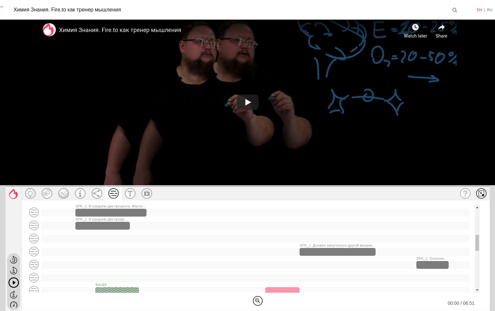

Платформа ProtoBrain позволяет автоматически протоколировать групповые коммуникации и полностью автоматизировать процесс сбора, хранения, анализа и создания медиаконтента. В данном случае это работа с видео и текстовыми данными. С помощью HTTP API можно взаимодействовать с данными, преобразовывая их и визуализируя специальными средствами.

## Пример
[Решение задачи детекции списка слов в транскрибации сообщений спикеров(диаризации)](examples/README.md)

## Основные понятия

**Act** - минимально целостный акт коммуникации. Act содержит в себе указание на видео или аудио, которое является таймлайном для всех связанных с актом данных. По сути является агригирующей и контекстом для связанных сущностей. Пример - [https://arkhipelag2035.fire.to/act/5fa3d26fb949f/5fa3d9ba34bb4](https://arkhipelag2035.fire.to/act/5fa3d26fb949f/5fa3d9ba34bb4#scenes)

В интерфейсе акт представляется простой страницей с видео или аудио плеером и специальным виджетом для отображения дополнительной информации:



**Data Layer** - абстрактный контейнер данных, связанный с актом. Он имеет тип и хранит только определенный набор данных (Data Layer Item)

**Data Layer Item** - типизированная единица данных, хранящаяся в DataLayer. Например, в Data Layer Item может хранится результат транскрибации, диаризации, сцены и тд.


**Процессинг и данные.**

**Транскрибация** - это процесс преобразования входящего аудиопотока в распознанный текст. Результат преобразования сохраняется в отдельный слой данных связанный с актом.

**Диаризация** - процесс разделения входящего аудиопотока на однородные сегменты в соответствии с принадлежностью аудиопотока тому или иному говорящему. Результат сохраняется в отдельный слой данных (Data Layer Item), связанный с актом.

**Сцена (scene)**- некоторый более мелкий, по сравнению с актом, этап таймлайна. Хранится в отдельном слое данных (Data Layer). Используется для визуализации и индикации данных на общем таймлайне акта. 

Сцена может быть создана только в определенном слое (Data Layer, как можно видеть на рисунке ниже):


## Cases (примеры реализаций)

**Контроль звонков в call-центрах**

Речевая аналитика звонков или переговоров [на основе транскрибации и текстового поиска.](examples/README.md)

**Извлечение фактов из распознанного текста**

На основе [Томита-парсер](https://yandex.ru/dev/tomita/) вы сможете извлекать факты из текстов. Например, даты и время запланированных мероприятий для записи их в календарь.  


## Как использовать?

Для работы доступно HTTP API, которое позволяет работать со всеми сущностями описанными выше.

Для работы подходит любой HTTP клиент. В случае успешного запроса API вернет либо сообщение об успешной операции(в случае POST запроса), либо данные или ошибку.

Каждый HTTP запрос независимо от метода должен передавать указанные ниже заголовки:

    'Content-Type': 'application/json',
    'X-API-Authorization': 'Bearer {ACCESS_TOKEN}'
    'x-api-key': 'a57dc3a8-c78a-488a-b3f2-0c3e26c4ff28',
    'x-api-fingerprint': 'protobrain',
    'cache-control': 'no-cache',
    'x-api-workspace-id': 'arkhipelag2035_fire_to'

    {} - плейсхолдер, в который необходимо записать значение токена.

*Токен для работы с API должен быть получен отдельно.

## Описание взаимодействия с API

**Получить список актов**

```
GET https://api.protobrain.io/api/v1/fire/act/novelties?offset=0&limit=50
```
    
```jsonc
{
  "count": 1,
  "data": [
    {
      "id": 25006,
      "data": {
        "title": "Заголовок",
        "description": "Заголовок",
        "speaker_id": 0,
        "thumbnail_url": "https:\/\/i.ytimg.com\/vi\/IWy25ty8JkQ\/mqdefault.jpg",
        "thumbnail_height": 180,
        "thumbnail_width": 320,
        "processing": { // Этот блок содержит информацию о статусах обработчиков.
          "jobs": {
            "transcription": {
              "tinkoff": {
                "status": "finished",  // В случае если обработка успешно завершена и можно получить данные по API, статус - finished
                "template_id": "tinkoff_to_text"
              },
              "kaldi": {
                "status": "new", // В случае если обработка еще не началась, статус - new (запустить обработку можно в виджете на сайте воркспейса)
                "template_id": "kaldi_to_text"
              },
              "yandex": {
                "status": "in_progress", // В случае если обработка выполняется в данный момент - in_progress
                "template_id": "yandex_to_text"
              },
              "google": {
                "status": "new",
                "template_id": "google_to_text"
              }
            },
            "diarization": {
              "kaldi": {
                "status": "finished",
                "template_id": "kaldi_{{act:content_type}}_to_speakers"
              }
            },
            "berne_role_detection": {
              "default": {
                "status": "new",
                "template_id": "berne_role_detection"
              }
            },
            "alpha_rhythm": {
              "default": {
                "status": "new",
                "template_id": "alpha_rhythm"
              }
            },
            "voice_activity_detector": {
              "default": {
                "status": "new",
                "template_id": "voice_activity_detector"
              }
            }
          }
        }
      },
      "url": "https:\/\/arkhipelag2035.fire.to\/act\/5fa3d26fb949f\/5fa3d271494f9",
      "base_personal_hash": "5fa3d271494f9"
    }
  ]
}
```

**Получить информацию по акту**

```
GET https://api.protobrain.io/api/v1/act/{act_id}/expanded
```

```jsonc
{
  "act": {
    "id": 25006,
    "changed": "2020-11-05T04:17:50+00:00",
    "created": "2020-11-05T10:22:39+00:00",
    "stream_id": 195,
    "alias": "5fa3d26fb949f",
    "started": null,
    "finished": null,
    "content_type": "video",
    "hidden": false,
    "is_deleted": false,
    "target_box_id": null,
    "meta": {
      "is_claimed": false,
      "has_access": true,
      "duration": 520,
      "exists_in_playlists": []
    },
    "data": {
        "title": "Заголовок",
        "description": "Заголовок",
        "speaker_id": 0,
        "thumbnail_url": "https:\/\/i.ytimg.com\/vi\/IWy25ty8JkQ\/mqdefault.jpg",
        "thumbnail_height": 180,
        "thumbnail_width": 320,
        "processing": {
          "jobs": {
            "transcription": {
              "tinkoff": {
                "status": "finished",
                "template_id": "tinkoff_to_text"
              },
              "kaldi": {
                "status": "new",
                "template_id": "kaldi_to_text"
              },
              "yandex": {
                "status": "new",
                "template_id": "yandex_to_text"
              },
              "google": {
                "status": "new",
                "template_id": "google_to_text"
              }
            },
            "diarization": {
              "kaldi": {
                "status": "finished",
                "template_id": "kaldi_{{act:content_type}}_to_speakers"
              }
            },
            "berne_role_detection": {
              "default": {
                "status": "new",
                "template_id": "berne_role_detection"
              }
            },
            "alpha_rhythm": {
              "default": {
                "status": "new",
                "template_id": "alpha_rhythm"
              }
            },
            "voice_activity_detector": {
              "default": {
                "status": "new",
                "template_id": "voice_activity_detector"
              }
            }
          }
        }
      },
    "url": "https:\/\/arkhipelag2035.fire.to\/act\/5fa3d26fb949f\/5fa3d271494f9",
    "base_personal_hash": "5fa3d271494f9"
  },
  "video_data_layer": {
    "id": 281228,
    "type": "video",
    "changed": "2020-11-05T04:17:50+00:00",
    "created": "2020-11-05T10:22:39+00:00",
    "entity_type": "act",
    "entity_id": 25006,
    "subtype": null,
    "source_data_layer_id": null,
    "is_deleted": false,
    "meta": {}
  },
  "video": {
    "length": 520,
    "url": "https:\/\/www.youtube.com\/watch?v=IWy25ty8JkQ",
    "video_id": "IWy25ty8JkQ",
    "thumbnail": "https:\/\/i.ytimg.com\/vi\/IWy25ty8JkQ\/mqdefault.jpg",
    "thumbnail_height": 180,
    "thumbnail_width": 320,
    "video_provider_id": "video_youtube",
    "data_layer_id": 281228
  }
}
```

**Получить транскрибацию акта**

```
GET https://api.protobrain.io/api/v1/act/{act_id}/data_layer/transcription?include_items=1
```

Возвращает список Data Layer и вложенных Data Layer Item для каждого из провайдеров транскрибации
```jsonc
{
  "count": 1,
  "data": [
    {
      "data_layer": {
        "id": 281249,
        "type": "transcription",
        "changed": "2020-11-03T11:44:10+00:00",
        "created": "2020-11-05T10:28:56+00:00",
        "entity_type": "act",
        "entity_id": 25006,
      },
      "data_layer_items": [
        {
          "start": 5.4,
          "end": 515.88,
          "channel_tag": 1,
          "transcript": "",
          "confidence": 1,
          "provider_id": "tinkoff",
          "words": [
            {
              "confidence": -2.578805923461914,
              "duration": 0.15,
              "end": 5.55,
              "start": 5.4,
              "word": "слово"
            },
            {
              "confidence": -8.748217582702637,
              "duration": 0.2,
              "end": 5.9,
              "start": 5.7,
              "word": "слово2"
            },
            {
              "confidence": -90.2383804321289,
              "duration": 0.03,
              "end": 479.73,
              "start": 479.7,
              "word": "слово3"
            },
            {
              "confidence": -164.29393005371094,
              "duration": 0.48,
              "end": 515.88,
              "start": 515.4,
              "word": "слово4"
            }
          ],
          "data_layer_id": 281249,
          "changed": 1604572136,
          "id": 1183149
        }
      ]
    }
  ]
}
```


**Получить диаризацию акта**
```
https://api.protobrain.io/api/v1/act/{act_id}/data_layer/speaker_diarisation?include_items=1
```

Возвращает список Data Layer и вложенных Data Layer Item
```jsonc
{
  "count": 1,
  "data": [
    {
      "data_layer": {
        "id": 47875,
        "type": "speaker_diarisation",
        "changed": "2020-03-23T07:43:34+00:00",
        "created": "2020-03-31T07:52:35+00:00",
        "entity_type": "act",
        "entity_id": 4004
      },
      "data_layer_items": [
        {
          "start": 0,
          "end": 406.73,
          "speakers": [
            {
              "partitions": [
                {
                  "end": 7.08,
                  "start": 0.85
                },
                {
                  "end": 15.53,
                  "start": 12.78
                },
                {
                  "end": 37.09,
                  "start": 18.6
                },
                {
                  "end": 102,
                  "start": 38.99
                },
                {
                  "end": 335.84,
                  "start": 104.15
                },
                {
                  "end": 406.73,
                  "start": 337.15
                }
              ],
              "speaker_id": "SPK_1"
            },
            {
              "partitions": [
                {
                  "end": 11.89,
                  "start": 11.02
                },
                {
                  "end": 18.17,
                  "start": 16.47
                },
                {
                  "end": 37.58,
                  "start": 37.18
                },
                {
                  "end": 102.46,
                  "start": 102.07
                },
                {
                  "end": 337.06,
                  "start": 336.68
                }
              ],
              "speaker_id": "SPK_2"
            }
          ],
          "data_layer_id": 47875,
          "changed": 1585641155,
          "id": 286883
        }
      ]
    }
  ]
}
```

**Создать слой**

```
POST https://api.protobrain.io/api/v1/fire/act/{act_id}/data_layer
```

Данные ()

```jsonc
{
    "type": "label", // Всегда label
    "subtype": "scene", // Всегда scene
    "act_id": 4004, // ID акта, в котором вы хотите создать слой
    "color": "#6FCF97", // Цвет в HEX
    "is_private": false, // Для того, чтобы все видили ваши слои
    "comment": "Test" // Комментарий, если необходимо
}
```

Ответ
```jsonc
{
  "id": 11111,
  "type": "label",
  "changed": "2020-11-09T10:30:58+00:00",
  "created": "2020-11-09T11:35:46+00:00",
  "entity_type": "act",
  "entity_id": 4004,
  "subtype": "scene",
  "source_data_layer_id": null,
  "is_deleted": false,
  "meta": {
    "platform_client_id": 11111,
    "profile_id": 11111,
    "created": 1604921746,
    "comment": "Test",
    "color": "#6FCF97",
    "custom_image_url": null,
    "is_private": true,
    "source_data_layer_id": "",
    "data_layer_id": 11111,
    "timestamp": 1604921746,
    "source_data_layer_item_id": null,
    "data_transformer_id": null,
    "data_processing_info": [],
    "changed": 1604921746,
    "is_deleted": false,
    "external": null,
    "is_invalid": false,
    "id": 11111
  }
}
```

**Создать сцену в слое**

```
POST https://api.protobrain.io/api/v1/fire/label/scene

```

Запрос

```jsonc
{
    "data_layer_id": 11111, // Data layer id, из прошлого запроса
    "position": 179, // Позиция относительно таймалайна акта (если это видео количество секунд от начала)
    "length": 41, // Длинна сцены в секундах
    "comment": "Test", // Коментарий если необходимо
    "color": "#C78EE2" // Цвет в HEX
}
```

Ответ

```jsonc
{
  "position": 179,
  "length": 41,
  "type": "scene",
  "platform_client_id": 112657,
  "created": 1604921964,
  "profile_id": 80370,
  "comment": "Test",
  "scene_type": "default",
  "emoji": null,
  "emotion_type": null,
  "audio_url": "",
  "color": "#C78EE2",
  "custom_image_url": null,
  "background_image_url": null,
  "votes": [],
  "is_private": false,
  "coordinate_x": 0,
  "coordinate_y": 0,
  "rating": {
    "type": "five_stars",
    "average": 0,
    "value": {
      "1": 0,
      "2": 0,
      "3": 0,
      "4": 0,
      "5": 0
    }
  },
  "related_data_layer_item": null,
  "data_layer_id": 11111,
  "timestamp": 1604921964,
  "source_data_layer_item_id": null,
  "data_transformer_id": null,
  "data_processing_info": [],
  "changed": 1604921964,
  "is_deleted": false,
  "external": null,
  "is_invalid": false,
  "id": 1210136,
  "meta": {
    "scene_fires_count": 0,
    "scene_fire_authors_count": 0,
    "rating_is_already_voted": false
  }
}
```